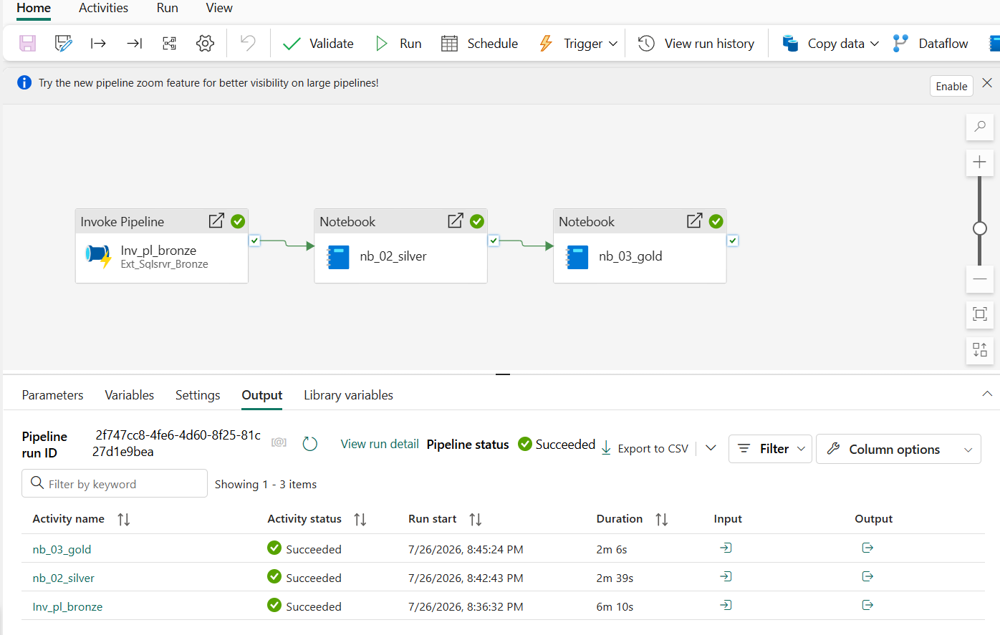

# Prueba Técnica Data Engineering 

## Declaración de Escenario y Plataforma
* **Escenario Seleccionado:** Escenario B - RetailMax
* **Plataforma Implementada:** Microsoft Fabric (Lakehouse architecture & Data Factory Orchestration)
* **Lenguaje Principal:** PySpark / Spark SQL

---

## Arquitectura de Solución (Medallion Architecture)

El flujo de procesamiento sigue la arquitectura Medallion tal cual fue solicitada y  para garantizar calidad, trazabilidad y rendimiento en el Data Lakehouse:

1. **Bronze (Data Cruda):** Ingesta directa de las tablas transaccionales desde el origen SQL Server mediante pipeline sin transformaciones.
   **Nota de Ingesta:** La extracción de la base de datos origen hacia `LH_Bronze` se orquestó mediante un Data Pipeline de Microsoft Fabric. El script `01_bronze_ingestion.py` documenta la estructura lógica de la ingesta en formato Delta Lake.
3. **Silver (Zona de limpieza):** Limpieza de datos, estandarización de tipos, deduplicación, manejo de valores nulos y generación de llaves subrogadas (`sk_cliente`, `sk_producto`).
4. **Gold (Zona final):** Modelado multidimensional enfocado en el análisis RFM (Recency, Frequency, Monetary) para segmentación de clientes y cálculo de alertas de negocio.

---

## Orquestación del Pipeline

La orquestación de extremo a extremo se realiza mediante Microsoft Fabric Data Factory a través del pipeline `PL_retailmax_medallion`:

###  Ejecución del Pipeline Maestro (DAG)

* **Actividad 1 (`Invoke Pipeline`):** Desencadena el pipeline `Ext_Sqlsrvr_Bronze` para la ingesta del origen.
* **Actividad 2 (`Notebook`):** Procesa las reglas de transformación hacia la capa Silver (`02_Silver_processing`).
* **Actividad 3 (`Notebook`):** Genera la capa analítica Gold (`03_Gold_processing`) con las métricas RFM.

> *La evidencia gráfica del pipeline ejecutado con éxito se encuentra documentada en la carpeta `/docs`.*
## Modelo RFM y Reglas de Negocio
* **Recency:** Días transcurridos desde la última transacción del cliente.
* **Frequency:** Cantidad total de transacciones completadas por el cliente.
* **Monetary (`monetary_val`):** Monto acumulado total de ventas generadas.

  

##  Casos de Uso y Necesidades del Negocio Resueltas

La arquitectura Medallion implementada, específicamente en la **Capa Gold**, fue modelada para dar respuesta directa a las necesidades analíticas de RetailMax:

1. **Prevención de Quiebre de Stock:** 
   * *Solución:* Implementación de `FACT_INVENTARIO` para cruzar el stock actual con la velocidad de consumo y tiempos de reabastecimiento, permitiendo alertas tempranas a 7 días.
2. **Segmentación de Clientes (Modelo RFM):** 
   * *Solución:* Construcción de la tabla `METRICAS_RFM` que calcula el Recency, Frequency y Monetary value, permitiendo agrupar a los clientes de fidelización en 5+ segmentos de valor.
3. **Análisis de Conversión y Ticket Promedio:** 
   * *Solución:* Uso de `FACT_VENTAS` cruzada con la dimensión de canales y categorías para obtener la tasa de conversión y el ticket promedio.
4. **Mitigación de Devoluciones:** 
   * *Solución:* Integración de `FACT_DEVOLUCIONES` para identificar patrones de causa raíz por motivo, categoría, proveedor y canal.
5. **Dashboard Ejecutivo Comercial:** 
   * *Solución:* Consolidación del Star Schema (Ventas + Dimensiones conformadas) listo para ser conectado en modo DirectLake / Import a Power BI, entregando la vista diaria por país, tienda, canal y categoría.

