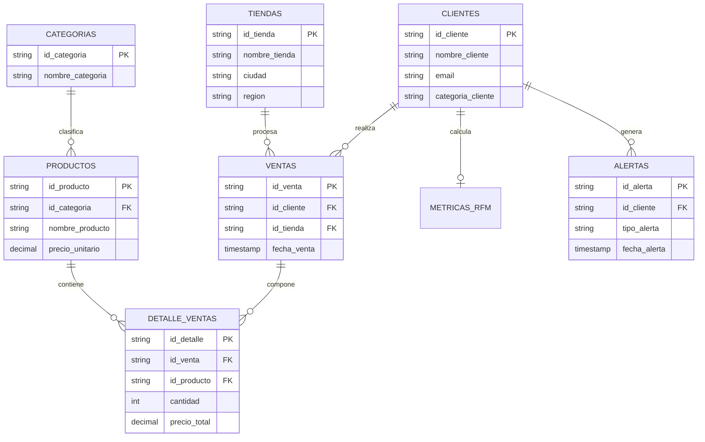
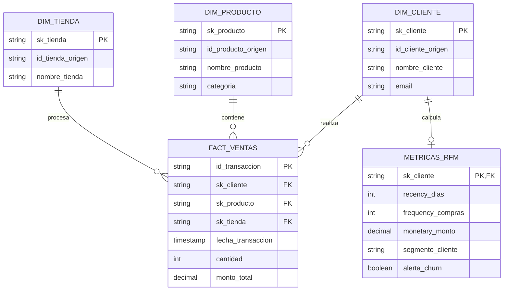

# Arquitectura de Datos y Modelo Entidad-Relación (MER)

## 1. Modelo Origen Transaccional (Capa Bronze - 7 Tablas)
Estructura normalizada ingestada desde el origen SQL Server hacia la capa Bronze:

---

## 2. Modelo Dimensional y Métricas (Capa Gold - Star Schema)
Transformación y desnormalización hacia el modelo analítico para consumo y análisis RFM:

