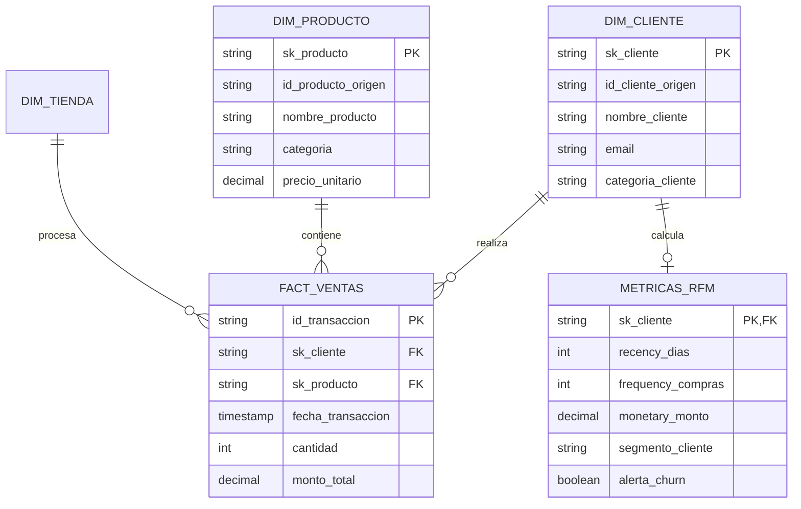

# Modelo Entidad-Relación (MER) - RetailMax

## Modelo Dimensional (Capa Gold)

El siguiente diagrama ilustra el modelo en estrella (Star Schema) diseñado para soportar el análisis de ventas y el modelo de segmentación RFM:

### Descripción de Entidades Principales:
* **`FACT_VENTAS`:** Tabla de hechos granular a nivel de ítem/transacción vendida.
* **`DIM_CLIENTE` / `DIM_PRODUCTO`:** Dimensiones con llaves subrogadas (`sk_`) generadas en la capa Silver para abstraer cambios en los IDs de origen.
* **`METRICAS_RFM`:** Tabla analítica en capa Gold con métricas agregadas por cliente, puntuación RFM (1-5) y banderas de alertas de negocio (`alerta_churn`).
